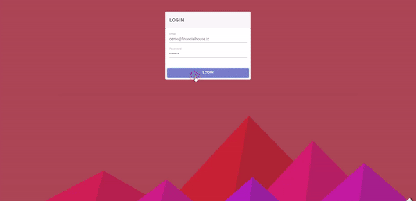

# financial-house
Financial House Case Study

# 1.Adım
Aşağıdaki kod satırı ile yeni proje oluşturabilirsiniz.\
Would you like to add Angular routing ? (YEs)\
Would stylesheet format would you like to use? (CSS)\
Bootstrap kullanacağım için CSS seçtim. \ 

    ng new project_name 

    Localhost üzerinde projeyi çalıştırmak için \

    ng serve --open

    Aşağıdaki kod ile nav adında üst bar için component oluşturdum \

    ng g c nav

    Sol tarafdaki menu için aşağıdaki menuyu oluşturdum \
    
    ng g c menu

    Sağ tarafdaki home sayfası için yeni component oluşturdum \

    ng g c home

    Bootstrap'i  projeye eklemek için \

    npm i bootstrap
    npm i font-awesome

    styles.css dosyasında tanımlı olan still dosyaları global'de tanımlı olarak gelir
    bu yüzden aşağıdaki kodları styles.css 'e ekleyebilirz. \

    @import "~bootstrap/dis/css/bootstrap.min.css";
    @import "~font-awesome/css/font-awesome.min.css"

    Diğer alternatif angular.json dosyasında içinde styles dizinine bu css eklenebilir. \
    "input": "./node_modules/bootstrap/dist/css/bootstrap.min.css",
    "input": "./node_modules/font-awesome/css/font-awesome.min.css"

    Heroku'da pipeline 'da oluşan hata loglarını takip etmek için; \

    heroku logs -t --app financial-case \

